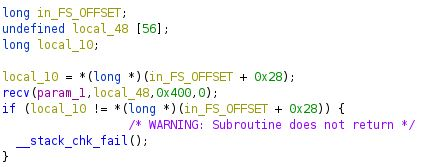

### Find pid, then pwn-tool attach
```
gdb> info inferior
gdb> python print(gdb.selected_inferior().pid)

# pwn tool
gdb.attach(1234)
```
http://docs.pwntools.com/en/stable/gdb.html

### get ELF pd
```
e = ELF('./paycalc')
r = e.process()
print util.proc.pidof(r) #an array of pid--> [1234] 
```

## gdb commands
```
info proc map
info inferior
x/20x $rsp

```

### ROP

[https://blog.techorganic.com/2016/03/18/64-bit-linux-stack-smashing-tutorial-part-3/](https://blog.techorganic.com/2016/03/18/64-bit-linux-stack-smashing-tutorial-part-3/) </br>
[https://ropemporium.com/guide.html](https://ropemporium.com/guide.html) </br>
[https://www.ret2rop.com/2018/08/format-string-defeating-stack-canary-nx-aslr-remote.html](https://www.ret2rop.com/2018/08/format-string-defeating-stack-canary-nx-aslr-remote.html) </br>
[ROP and pwn tool corefile debug](https://medium.com/@iseethieves/intro-to-rop-rop-emporium-split-9b2ec6d4db08) </br>


### static analysis
```
use ghidra , IDA pro free disassembl

```

## Setup :
### 1. socat/nc
```
socat TCP-LISTEN:1234,reuseaddr,fork EXEC:./vuln
nc 1234

nc -l 9999 --exec ./vuln
nc 9999

socat tcp-l:1235,fork exec:./vuln
nc 1235
``` 
https://stackoverflow.com/questions/46941045/netcat-for-execute-remote-elf-file-like-ctfs


### objdump
Check plt GOT
```objdump -d -s -j .plt -j .got.plt```

### Tools
```
gef
# via the install script
$ wget -q -O- https://github.com/hugsy/gef/raw/master/scripts/gef.sh | sh

# manually
$ wget -O ~/.gdbinit-gef.py -q https://github.com/hugsy/gef/raw/master/gef.py
$ echo source ~/.gdbinit-gef.py >> ~/.gdbinit


gdb-peda
git clone https://github.com/longld/peda.git ~/peda
echo "source ~/peda/peda.py" >> ~/.gdbinit
echo "DONE! debug your program with gdb and enjoy"
```

### Canary
 </br>